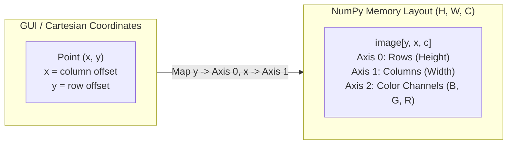

# Module 01: Image Basics

## Overview

In visual computing, an image is not an opaque graphic format (PNG, JPEG). It is a multidimensional numerical tensor representing spatial electromagnetic irradiance sampled across a discrete grid.

This module establishes the foundational data structures and memory layouts used throughout the entire curriculum using pure NumPy array manipulation.

---

## Key Engineering Concepts

### Matrix Indexing vs Cartesian Coordinates

A common point of failure in computer vision pipelines is coordinate confusion:
- **Cartesian / GUI Space $(x, y)$:** $x$ represents horizontal column offset; $y$ represents vertical row offset.
- **Matrix / NumPy Space $[row, col]$:** Indexed as `image[y, x]`. The first dimension is height ($H$, rows), the second is width ($W$, columns).



### Channel Ordering (BGR vs RGB)
OpenCV historically loads and handles images in **BGR** (Blue, Green, Red) channel order rather than standard **RGB**. 
- Channel 0: Blue
- Channel 1: Green
- Channel 2: Red

Passing a BGR buffer directly into libraries expecting RGB (such as Matplotlib or ModernGL shaders) swaps red and blue color channels.

### Bit Depth & Dynamic Range
- **`uint8`:** Integer values in $[0, 255]$. Standard for frame capture, display buffers, and network transmission. Prone to underflow/overflow during mathematical operations (e.g., $250 + 10 = 4$ in uint8 wrap-around arithmetic).
- **`float32`:** Normalized floating point values in $[0.0, 1.0]$ or centered $[-1.0, 1.0]$. Essential for gradient computation, convolutions, and neural inference to preserve numerical precision without clipping.

### Memory Layout (`C_CONTIGUOUS`)
NumPy slices (`img[:, :, ::-1]`) create strided views without copying memory. While efficient, passing non-contiguous memory views to low-level C++ libraries (OpenCV, OpenGL vertex buffers) can cause silent memory corruption or performance penalties. Always enforce `np.ascontiguousarray()` when passing strided slices to C-extensions.

---

## Running the Module

Execute the demonstration script using `make`:

```bash
make run phase-01/01-image-basics/main.py
```

The script generates synthetic test patterns, performs channel isolation and slicing, validates memory contiguity, and displays the resulting buffers.
