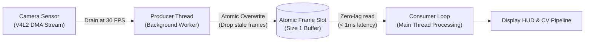

# Module 02: Webcam & Real-Time Ingestion

## Overview

Real-time visual computing requires deterministic, low-latency ingestion. Naive video capture loops often suffer from **buffer bloat**, where the operating system queues stale frames, introducing 100ms to 200ms of lag into downstream tracking and 3D rendering.

This module builds a production-grade, thread-isolated camera ingestion pipeline using OpenCV's Video4Linux (V4L2) backend.

---

## Key Engineering Concepts

### The Buffer Bloat Problem
By default, the Linux V4L2 driver and OpenCV buffer incoming camera frames (typically 3 to 5 frames deep). 
- If your processing pipeline takes 40ms per frame, the camera produces frames faster than you consume them.
- Calling `cap.read()` reads an **old** buffered frame from 150ms ago rather than the photons hitting the sensor right now.
- In interactive AR or digital twins, this creates visible motion latency and tracking rubber-banding.

### Threaded Producer-Consumer Architecture
To eliminate buffer lag, we decouple capture I/O from computation:
- **Producer Thread:** Runs a lightweight loop that continuously drains `cap.read()` into an atomic, size-1 memory slot (`self.latest_frame`). Older queued frames are overwritten immediately.
- **Consumer (Main Thread):** Requests the newest frame on demand (`cam.read()`) with near-zero queue latency (< 1ms).



### Telemetry & Observability
Every robust vision pipeline must monitor its compute budget:
- **FPS (Frames Per Second):** Measured via rolling exponential moving average.
- **Ingestion Latency:** Time delta between camera sensor exposure and frame handoff to consumer.
- **Frame Drop Metrics:** Tracking how many frames were dropped by design when consumer processing took longer than 33ms.

### Synthetic Fallback Mode
If no hardware webcam (`/dev/video*`) is available (e.g. running in CI, a VM, or a headless server), the pipeline automatically falls back to an animated synthetic test feed so code can be verified without hardware dependencies.

---

## Running the Module

Execute via the project Makefile:

```bash
make run phase-01/02-webcam/main.py
```

### Interactive Controls
- **`c`:** Switch/cycle between detected camera devices on the fly.
- **`s`:** Save current frame snapshot to `phase-01/02-webcam/output/`.
- **`t`:** Toggle synthetic test generator mode on/off.
- **`q` or `Esc`:** Gracefully stop capture and close windows.
