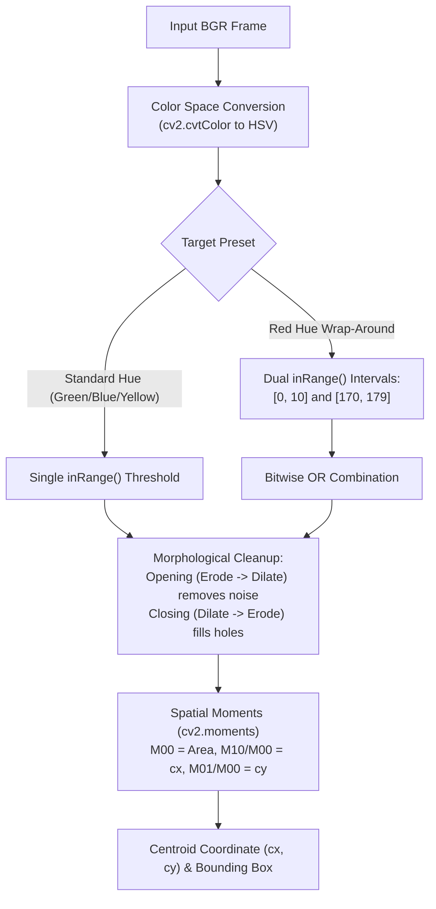

# Module 04: Color Detection & Perceptual Color Spaces

## Overview

In the physical world, detecting an object by its color is challenging because real-world lighting constantly changes. Shadows dim pixels, while desk lamps and sunlight wash them out with white specular glare.

This module explores perceptual color spaces (**HSV** and **LAB**), explains why naive BGR thresholding fails under varying illumination, and implements an interactive color segmentation and calibration tool.

---

## Key Engineering Concepts

### Why BGR Thresholding Fails
In BGR, color (chrominance) and brightness (luminance) are mathematically coupled across all three channels.
- When an object enters a shadow, its Blue, Green, and Red values all drop simultaneously.
- When bright light reflects off the object, all three values spike toward 255 (white).
- A bounding box in BGR color space cannot separate "a dim red ball" from "a bright gray shadow."

### The Cylindrical HSV Color Space
HSV decouples chromaticity (pigment) from illumination:

1. **Hue ($H \in [0, 179]$ in OpenCV):**
   The angular position on the color wheel ($0^\circ$ to $360^\circ$ divided by 2 to fit within an 8-bit integer):
   - Red: $\sim 0..10$ and $170..179$ (wraps around $0^\circ$).
   - Yellow: $\sim 20..35$.
   - Green: $\sim 35..85$.
   - Blue: $\sim 90..130$.
2. **Saturation ($S \in [0, 255]$):**
   The purity or vibrancy of the color. Low saturation is grayish/washed out; high saturation is rich pigment.
3. **Value ($V \in [0, 255]$):**
   The perceived intensity of light. Setting $V_{\min} > 50$ filters out dark room shadows; setting $S_{\min} > 70$ filters out neutral white background walls.

### The Red Wrap-Around Problem
Because Hue is circular, pure red spans both ends of the scale ($350^\circ$ to $10^\circ$). In OpenCV ($[0, 179]$), red sits at both $[0, 10]$ and $[170, 179]$. 
Detecting red requires computing two masks and merging them with a bitwise OR operation:

$$\text{Mask}_{\text{red}} = \text{inRange}(I_{\text{HSV}}, [0, S_{\min}, V_{\min}], [10, S_{\max}, V_{\max}]) \lor \text{inRange}(I_{\text{HSV}}, [170, S_{\min}, V_{\min}], [179, S_{\max}, V_{\max}])$$



### Morphological Noise Cleanup
Raw color masks frequently contain sensor noise (isolated white speckles) and internal dropouts (small dark holes from texture or reflections). We clean the binary mask using morphological operations:
- **Opening (Erosion followed by Dilation):** Eliminates tiny false-positive specks.
- **Closing (Dilation followed by Erosion):** Fills false-negative interior holes without changing the object's outer dimensions.

### Centroid Extraction (Spatial Moments)
Once a clean binary mask is obtained, its center of mass $(c_x, c_y)$ is computed via zeroth- and first-order spatial moments:

$$c_x = \frac{M_{10}}{M_{00}}, \quad c_y = \frac{M_{01}}{M_{00}}$$

Where $M_{00}$ is the total pixel area of the target. This provides the continuous coordinate stream required for real-time tracking in Module 07.

---

## Running the Module

Execute via the project Makefile:

```bash
make run phase-02/04-color-detection/main.py
```

### Interactive Controls
- **`1`:** Red preset (handles wrap-around)
- **`2`:** Green preset
- **`3`:** Blue preset
- **`4`:** Yellow preset
- **`5`:** Custom Trackbar Calibration mode (tune HSV sliders in real time)
- **`c`:** Switch active camera (0 <-> 2)
- **`s`:** Save calibration snapshot and parameters to `output/`
- **`q` or `Esc`:** Quit
