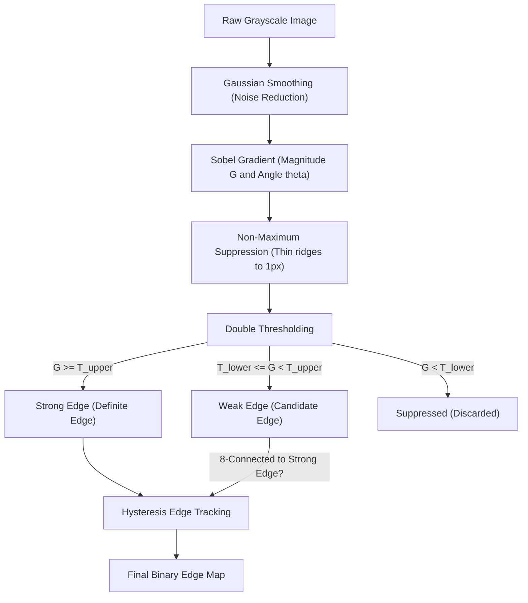

# Module 05: Edge Detection & Spatial Gradients

## Overview

In Module 04, we segmented objects by color thresholds in HSV space. While fast, color segmentation is fragile when illumination changes or shadows fall across an object.

Edge detection isolates **structural information** by finding sharp discontinuities in pixel brightness. Edges preserve geometric shape and boundaries while discarding redundant photometric intensity data. This module explores:
1. First-order directional derivatives using **Sobel** and **Scharr** convolution kernels.
2. Gradient magnitude ($G$) and continuous gradient direction ($\theta$).
3. Real-time **HSV gradient angle visualization** (mapping edge orientation to color hues).
4. Second-order isotropic derivatives via the **Laplacian** operator and zero-crossings.
5. The complete four-stage **Canny edge detection pipeline**.

---

## Key Engineering Concepts

### First-Order Derivatives: Sobel & Scharr Operators

An image can be modeled as a continuous 2D intensity function $I(x, y)$. The image gradient is a vector pointing in the direction of the greatest rate of increase of intensity:

$$\nabla I = \begin{bmatrix} G_x \\ G_y \end{bmatrix} = \begin{bmatrix} \frac{\partial I}{\partial x} \\ \frac{\partial I}{\partial y} \end{bmatrix}$$

Because digital images are discrete pixel grids, partial derivatives are approximated using convolution kernels.

#### Sobel Operator ($3 \times 3$)
The Sobel operator combines Gaussian smoothing with finite-difference differentiation:

$$K_x = \begin{bmatrix} -1 & 0 & +1 \\ -2 & 0 & +2 \\ -1 & 0 & +1 \end{bmatrix}, \quad K_y = \begin{bmatrix} -1 & -2 & -1 \\ 0 & 0 & 0 \\ +1 & +2 & +1 \end{bmatrix}$$

- $K_x$ highlights vertical edges (horizontal intensity changes).
- $K_y$ highlights horizontal edges (vertical intensity changes).

#### Scharr Operator ($3 \times 3$)
For small $3 \times 3$ kernels, Sobel suffers from rotational variance (unequal response across different edge angles). The Scharr operator achieves higher rotational symmetry and more accurate first derivatives:

$$K_x^{\text{Scharr}} = \begin{bmatrix} -3 & 0 & +3 \\ -10 & 0 & +10 \\ -3 & 0 & +3 \end{bmatrix}, \quad K_y^{\text{Scharr}} = \begin{bmatrix} -3 & -10 & -3 \\ 0 & 0 & 0 \\ +3 & +10 & +3 \end{bmatrix}$$

---

### Gradient Magnitude and Orientation

From $G_x$ and $G_y$, we compute two critical spatial properties per pixel:

1. **Gradient Magnitude ($G$):**
   $$G = \sqrt{G_x^2 + G_y^2} \quad \text{or approximated as} \quad |G_x| + |G_y|$$
   Represents the strength of the edge.

2. **Gradient Orientation ($\theta$):**
   $$\theta = \text{atan2}(G_y, G_x) \in [-\pi, \pi]$$
   Points perpendicular to the physical edge direction.

#### Vector Field Angle Map via HSV
To visualize edge orientation intuitively, we encode the gradient angle $\theta$ directly into HSV color space:
- **Hue ($H$):** Angle $\theta$ mapped to $[0, 179]$ (horizontal edges appear green/magenta, vertical edges appear blue/red).
- **Saturation ($S$):** Clamped to maximum ($255$).
- **Value ($V$):** Modulated directly by normalized gradient magnitude $G$. Weak gradients fade to black, while sharp edges glow with their orientation color.

---

### Second-Order Derivatives: The Laplacian Operator

The Laplacian is an isotropic (rotationally invariant) second-order derivative:

$$\Delta I = \nabla^2 I = \frac{\partial^2 I}{\partial x^2} + \frac{\partial^2 I}{\partial y^2}$$

Represented discretely as:

$$K_{\text{Laplacian}} = \begin{bmatrix} 0 & 1 & 0 \\ 1 & -4 & 1 \\ 0 & 1 & 0 \end{bmatrix} \quad \text{or} \quad \begin{bmatrix} 1 & 1 & 1 \\ 1 & -8 & 1 \\ 1 & 1 & 1 \end{bmatrix}$$

While the first derivative produces an intensity peak at an edge, the second derivative produces a **zero-crossing** (a sharp transition from positive to negative). Because second derivatives amplify high-frequency noise, images are always pre-smoothed with a Gaussian filter (Laplacian of Gaussian, or LoG).

---

### The Canny Edge Detection Pipeline (1986)

Developed by John F. Canny, this optimal multi-stage algorithm guarantees single-pixel edge responses and low false-positive rates:



1. **Gaussian Smoothing:** Suppresses high-frequency sensor noise.
2. **Gradient Calculation:** Computes directional derivatives $G_x$ and $G_y$.
3. **Non-Maximum Suppression (NMS):** Scans along the gradient direction $\theta$ (quantized to $0^\circ, 45^\circ, 90^\circ, 135^\circ$). If the current pixel's magnitude is not strictly greater than its two neighbors along the gradient line, it is suppressed to zero. This thins wide ridges down to 1-pixel-wide lines.
4. **Double Thresholding:**
   - Pixels above $T_{\text{upper}}$ are **strong edges**.
   - Pixels between $T_{\text{lower}}$ and $T_{\text{upper}}$ are **weak edges**.
   - Pixels below $T_{\text{lower}}$ are discarded.
5. **Hysteresis Edge Tracking:** Weak edges are retained only if they are topologically connected (8-connected neighborhood) to a strong edge. Isolated weak edges caused by noise are rejected.

---

## Running the Module

Execute via the project Makefile:

```bash
make run phase-02/05-edge-detection/main.py
```

### Interactive Controls
- **`1`:** Canny Edge Pipeline (single-pixel thin edges with hysteresis tracking)
- **`2`:** Sobel Gradient Magnitude (first derivative $|G_x| + |G_y|$)
- **`3`:** Scharr Derivative (high-accuracy rotational gradient)
- **`4`:** Laplacian (second derivative zero-crossing)
- **`5`:** HSV Gradient Angle Map (vector field colorizing edge direction)
- **`Sliders`:** Adjust Canny Lower/Upper thresholds and Gaussian pre-blur kernel
- **`c`:** Cycle camera device (0 <-> 2)
- **`s`:** Save snapshot and dump filter parameters to `output/`
- **`q` or `Esc`:** Quit
