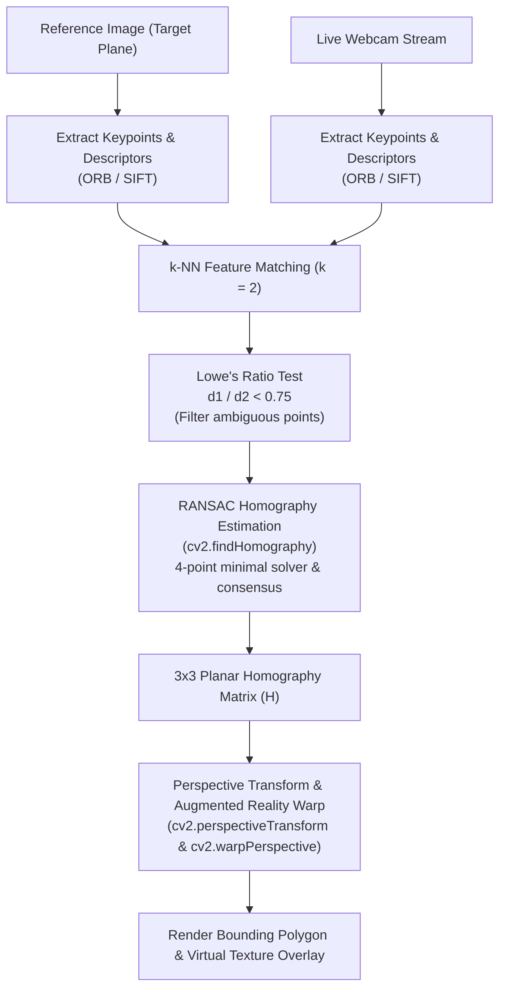

# Module 08: Feature Detection, Descriptors & Planar Homography

## Overview

In Modules 04–07, tracking and detection relied on global properties like color histograms or moving corner swarms. However, if an object rotates in 3D, gets partially occluded, or scales significantly, those methods break down.

This module introduces local invariant feature detection, binary and gradient descriptors, matching strategies, and robust geometric transformation estimation. We build the complete pipeline for planar object recognition and augmented reality perspective replacement:
1. Corner detectors: Harris Corner Detector and FAST (Features from Accelerated Segment Test).
2. Scale- and rotation-invariant keypoint descriptors: ORB (Oriented FAST and Rotated BRIEF) and SIFT (Scale-Invariant Feature Transform).
3. Descriptor matching: Brute-Force Matcher (Hamming distance for binary strings, L2 norm for float vectors) and FLANN (Fast Library for Approximate Nearest Neighbors).
4. Lowe's Ratio Test to eliminate ambiguous candidate matches.
5. RANSAC (Random Sample Consensus) geometric outlier rejection.
6. Planar Homography estimation ($3 \times 3$ matrix $\mathbf{H}$) and real-time perspective warp (augmented reality virtual billboard projection on a detected planar target).

---

## Key Engineering Concepts

### Keypoints vs. Descriptors
- **Keypoint ($x, y, \sigma, \theta$):** A distinctive, repeatable spatial location in the image characterized by high 2D gradient variation across multiple scales and dominant orientation $\theta$.
- **Descriptor ($\mathbf{d} \in \mathbb{R}^D$ or $\{0, 1\}^B$):** A compact numerical fingerprint describing the local pixel patch around the keypoint. Descriptors are engineered to remain invariant to changes in illumination, scale, in-plane rotation, and viewpoint perspective.

### ORB vs. SIFT
- **ORB (Oriented FAST and Rotated BRIEF):**
  - FAST detector locates corners across an image pyramid.
  - Computes the intensity centroid of each patch to assign an orientation angle $\theta$.
  - BRIEF generates a 256-bit binary string via pairwise intensity comparisons rotated by $\theta$.
  - Matching is computed via CPU bitwise XOR and POPCNT instructions (`cv2.NORM_HAMMING`), running at 60+ FPS on commodity hardware.
- **SIFT (Scale-Invariant Feature Transform):**
  - Detects extrema in Difference of Gaussians (DoG) scale space.
  - Builds a 128-dimensional floating-point vector of local gradient histograms.
  - Higher precision under extreme perspective skew, but requires floating-point $L_2$ Euclidean distance matching (`cv2.NORM_L2`).

### Ratio Test & RANSAC Homography
- **Lowe's Ratio Test:** For each query descriptor, find the two nearest neighbors in the target ($m_1$ and $m_2$). Retain the match only if:
  $$\frac{\text{dist}(m_1)}{\text{dist}(m_2)} < 0.75$$
  This discards false matches caused by repetitive textures or ambiguous background patterns.
- **Planar Homography Matrix ($\mathbf{H} \in \mathbb{R}^{3 \times 3}$):**
  Maps homogeneous pixel coordinates from the reference target plane $\mathbf{x}_{\text{ref}} = [x, y, 1]^T$ to the camera frame $\mathbf{x}_{\text{cam}} = [x', y', 1]^T$:
  $$\mathbf{x}_{\text{cam}} \sim \mathbf{H} \mathbf{x}_{\text{ref}}$$
- **RANSAC (Random Sample Consensus):**
  Iteratively selects minimal random subsets of 4 point pairs to solve $\mathbf{H}$, scoring each model by the number of inliers whose re-projection error is below a threshold (e.g., 3 pixels). Outliers caused by mismatching are completely discarded.



### Augmented Reality Perspective Warp
Once $\mathbf{H}$ is estimated:
1. Compute the 4 transformed bounding corners of the reference target in the webcam frame via perspective transform.
2. Invert $\mathbf{H}$ or warp a replacement image/video directly onto the detected planar target using `cv2.warpPerspective` and seamless alpha masking.

---

## Running the Module

Execute via the project Makefile:

```bash
make run phase-02/08-feature-detection/main.py
```

### Interactive Controls
- **`1`:** ORB Feature Matching & Homography (Fast binary descriptors)
- **`2`:** SIFT Feature Matching & Homography (High-precision gradient descriptors)
- **`3`:** Raw Keypoint Detection (Displays orientation vectors and octave scales)
- **`4`:** Augmented Reality Replacement (Warps virtual artwork onto detected planar object)
- **`Space`:** Capture current camera center crop as reference target
- **`c`:** Cycle camera device (0 <-> 2)
- **`s`:** Save snapshot and dump homography matrix to `output/`
- **`q` or `Esc`:** Quit
