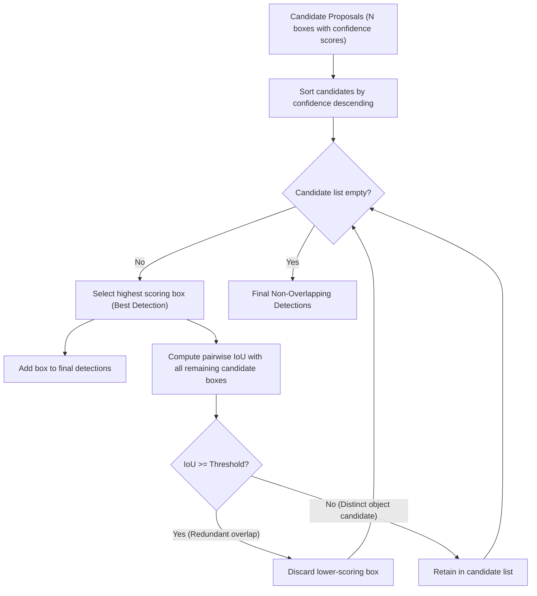

# Module 09: Object Detection & Non-Maximum Suppression

## Overview

Object detection extends classification by answering two questions simultaneously: *what* is in the image, and *where* is it located. Before deep neural networks like YOLO and Faster R-CNN, vision systems achieved detection through multi-scale sliding windows, feature extraction, and candidate suppression.

This module builds a self-contained, offline visual detection pipeline. It explores multi-scale image pyramids, correlation response maps, the storm of overlapping candidate proposals, and greedy Non-Maximum Suppression (NMS) using vectorized Intersection-over-Union (IoU).

---

## Key Engineering Concepts

### Bounding Box Representations

Spatial detections are parameterized across coordinate spaces:
- **Corner Format $[x_1, y_1, x_2, y_2]$:** Direct pixel bounds where $(x_1, y_1)$ is the top-left coordinate and $(x_2, y_2)$ is the bottom-right coordinate. Standard for raster rendering and IoU clipping.
- **Center-Dimension Format $[c_x, c_y, w, h]$:** Parameterizes the center coordinate $(c_x, c_y)$ alongside box width $w$ and height $h$. Standard for neural regression targets and Kalman filter tracking states.

### Multi-Scale Sliding Windows & Candidate Proposals

A target object appears at arbitrary pixel sizes depending on its physical distance from the camera lens. To detect objects at variable scales:
1. The target template is resized across a geometric scale pyramid (e.g., $0.7\times, 0.85\times, 1.0\times, 1.15\times, 1.3\times$).
2. Normalized cross-correlation maps evaluate candidate responses across every spatial position $(x, y)$.
3. Locations exceeding a confidence threshold emit candidate bounding boxes. Because neighboring pixels yield similar response scores, a single physical object triggers dozens of overlapping candidate proposals.

### Intersection over Union (IoU)

Intersection over Union measures spatial overlap between two bounding boxes $A$ and $B$:

$$\text{IoU}(A, B) = \frac{\text{Area}(A \cap B)}{\text{Area}(A \cup B)} = \frac{\text{Area}(A \cap B)}{\text{Area}(A) + \text{Area}(B) - \text{Area}(A \cap B)}$$

- $\text{IoU} = 1.0$: Identical spatial boxes.
- $\text{IoU} = 0.0$: Disjoint boxes with zero overlap.
- Standard suppression threshold: $\text{IoU} \in [0.30, 0.50]$.

### Greedy Non-Maximum Suppression (NMS)

Raw multi-scale detectors generate hundreds of overlapping false positives around high-confidence objects. Non-Maximum Suppression cleans this candidate storm down to distinct object detections:



---

## Running the Module

Execute via the project Makefile:

```bash
make run phase-03/09-object-detection/main.py
```

### Interactive Controls
- **`1`:** NMS Filtered View (Clean suppressed bounding boxes with confidence scores)
- **`2`:** Raw Proposal View (Visualizes the dense multi-scale candidate storm before NMS)
- **`3`:** Split View (Side-by-side comparison of raw proposals vs NMS-filtered detections)
- **`Space`:** Capture current frame center crop as the detection target template
- **`+` / `-`:** Increase / decrease detection confidence threshold ($\pm 0.02$)
- **`[` / `]`:** Increase / decrease NMS IoU suppression threshold ($\pm 0.05$)
- **`c`:** Cycle active camera index (0 <-> 2)
- **`s`:** Save detection snapshot to `output/`
- **`q` or `Esc`:** Quit
