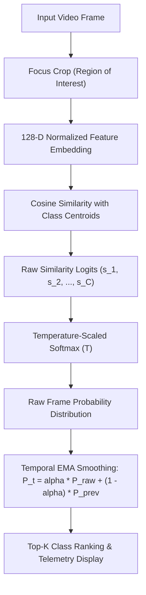

# Module 10: Image Classification & Feature Embeddings

## Overview

Image classification maps a high-dimensional raster image tensor $I \in \mathbb{R}^{H \times W \times C}$ to a discrete probability distribution over categorical classes $P(y = c | I)$. Modern convolutional networks and vision transformers accomplish this by projecting visual inputs into dense, metric-preserving **feature embeddings**.

This module builds a real-time, interactive visual embedding and classification pipeline with zero external model dependencies. It demonstrates multi-scale feature embedding extraction, cosine similarity metrics, Softmax probability distribution scaling, top-$k$ prediction ranking, and temporal Exponential Moving Average (EMA) smoothing for stable live video inference.

---

## Key Engineering Concepts

### High-Dimensional Feature Embeddings

Raw pixel values are notoriously sensitive to illumination changes and minute spatial translations. To classify visual patterns reliably, vision pipelines project raw image matrices into a compact $D$-dimensional latent vector $\mathbf{z} \in \mathbb{R}^D$:
- **Photometric Moments:** Channel means and standard deviations across both RGB and cylindrical HSV spaces capture pigment and lighting distribution.
- **Color Histograms:** 2D joint Hue-Saturation histograms provide illumination-tolerant chromatic representations.
- **Spatial Gradient Energy:** Directional Sobel derivatives quantized into orientation bins across spatial quadrants encode shape boundaries and structural geometry.
- **$L_2$-Normalization:** Enforces $\|\mathbf{z}\|_2 = 1.0$, projecting all embeddings onto the surface of a unit hypersphere so distances correspond directly to cosine similarity.

### Metric Learning & Nearest Centroid Classification

Given sample embeddings $\{\mathbf{z}_1, \dots, \mathbf{z}_N\}$ collected for class $c$, the class representation is modeled by its normalized prototype centroid:

$$\mathbf{\mu}_c = \frac{\sum_{i=1}^N \mathbf{z}_i}{\|\sum_{i=1}^N \mathbf{z}_i\|_2}$$

For a new query image with embedding $\mathbf{e}$, classification logits are computed via cosine similarity:

$$s_c = \mathbf{e} \cdot \mathbf{\mu}_c = \cos(\theta)$$

### Temperature-Scaled Softmax Distribution

To transform raw similarity logits into calibrated probability distributions that sum to $1.0$, we apply the Softmax function with temperature scaling $T$:

$$P(y = c | \mathbf{e}) = \frac{\exp(s_c / T)}{\sum_{j=1}^C \exp(s_j / T)}$$

- **High Temperature ($T > 0.5$):** Softens the probability distribution, spreading confidence across classes and expressing uncertainty.
- **Low Temperature ($T < 0.1$):** Sharpens the distribution into an argmax-like decision, amplifying the winning class.



### Temporal Exponential Moving Average (EMA) Smoothing

Single-frame neural and visual inferences suffer from high-frequency prediction jitter caused by sensor noise, hand tremor, and auto-exposure shifts. To deliver production-grade stability, predictions are smoothed across time using an Exponential Moving Average filter:

$$\bar{\mathbf{p}}_t = \alpha \mathbf{p}_t + (1 - \alpha) \bar{\mathbf{p}}_{t-1}$$

Where $\alpha \in [0.1, 0.3]$ is the smoothing factor:
- Suppresses single-frame misclassifications and spurious flickers.
- Maintains responsive classification latency without perceptible lag.

---

## Running the Module

Execute via the project Makefile:

```bash
make run phase-03/10-image-classification/main.py
```

### Interactive Controls
- **`1`, `2`, `3`, `4`:** Capture current focus crop as a training sample for Class 1, 2, 3, or 4
- **`t`:** Toggle temporal EMA prediction smoothing on/off (observe raw jitter vs smoothed stability)
- **`r`:** Reset and clear all learned class prototypes
- **`+` / `-`:** Increase / decrease Softmax temperature $T$ ($\pm 0.02$)
- **`c`:** Cycle active camera device index (0 <-> 2)
- **`s`:** Save classification snapshot and probability telemetry to `output/`
- **`q` or `Esc`:** Quit
